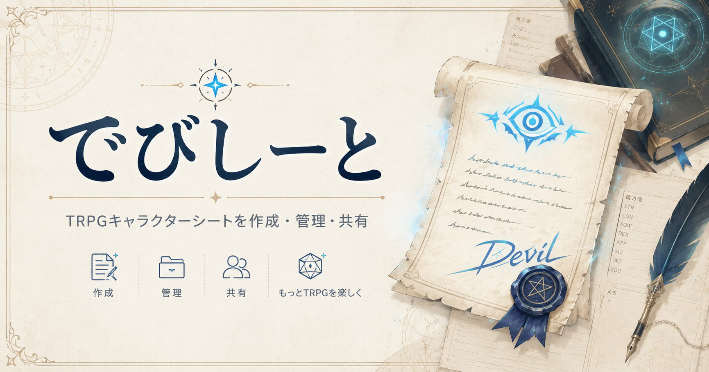

# v1.0.0 リリースノート

公開日: 2026-05-18

## 概要

でびしーとの初回公開リリースです。

[でびしーとを開く](https://devisheet.com/)

TRPGのキャラクターシートをオンラインで作成・管理・共有できるWebサービスとして、最初の対応シートである「魔道書大戦RPG マギカロギア」サプリメント「蒐集日記」の「傍流学派シート」を公開します。

## 主な機能

- 傍流学派シートを作成・閲覧・編集・削除できます。
- 学派名、構成員、蔵書、特記事項、メモ、功績点履歴、セッション履歴などをまとめて管理できます。
- PCとスマートフォンの両方で利用できます。
- シート一覧と検索から、公開されているシートを探せます。
- 公開範囲は、公開、リンク公開、非公開から選べます。
- 未ログインで作成したシートは、更新用パスワードで編集・削除できます。
- 非公開シートには、必要に応じて閲覧用パスワードを設定できます。
- Googleログインを使うと、作成したシートをマイリストで確認でき、パスワード入力なしで編集・削除できます。
- Googleログインユーザーは、アカウント削除ができます。
- シート所有者は、変更履歴を確認し、保存された履歴から復元できます。
- ログインユーザーは、他のユーザーの傍流学派シートへ構成員参加リクエストや成長報告リクエストを送れます。
- シート所有者は、届いたリクエストを承認・却下できます。
